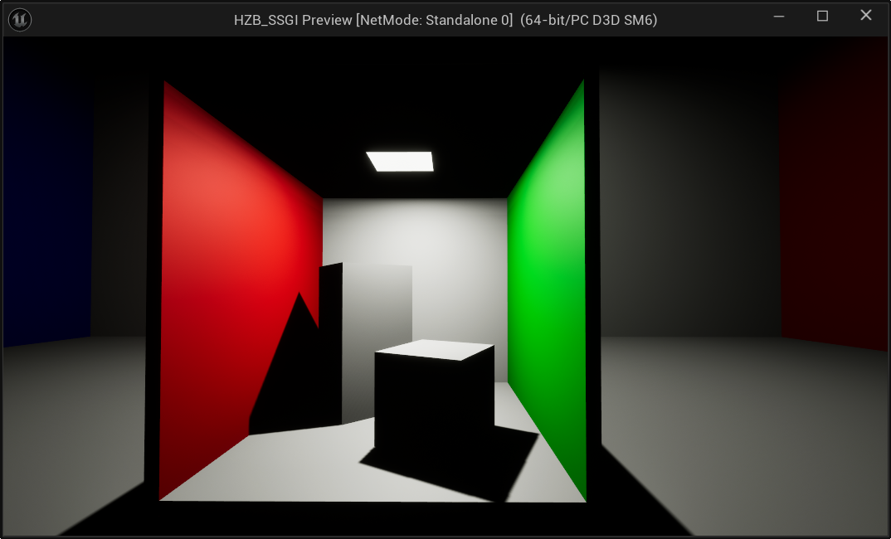
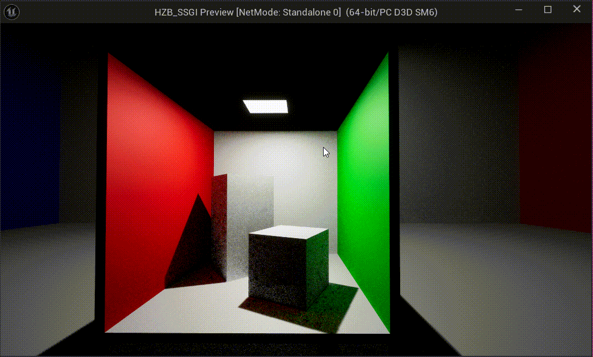
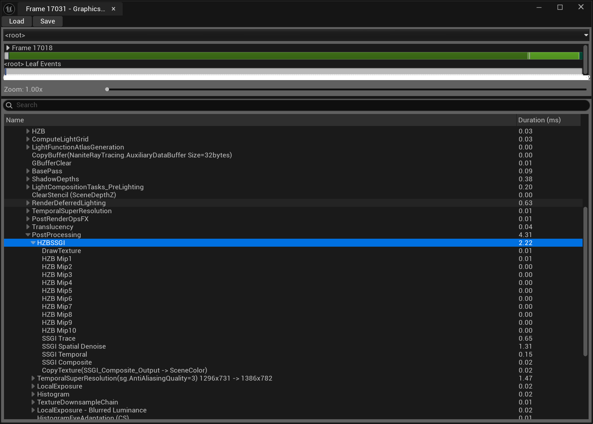
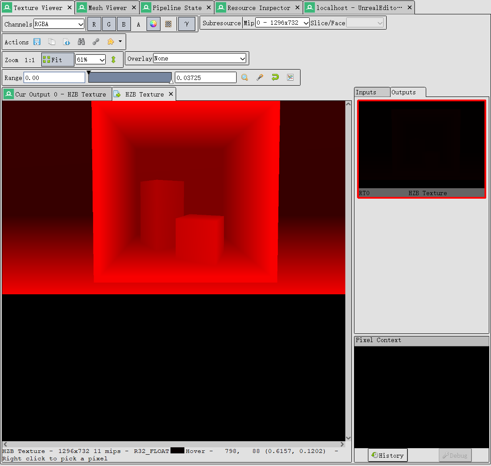
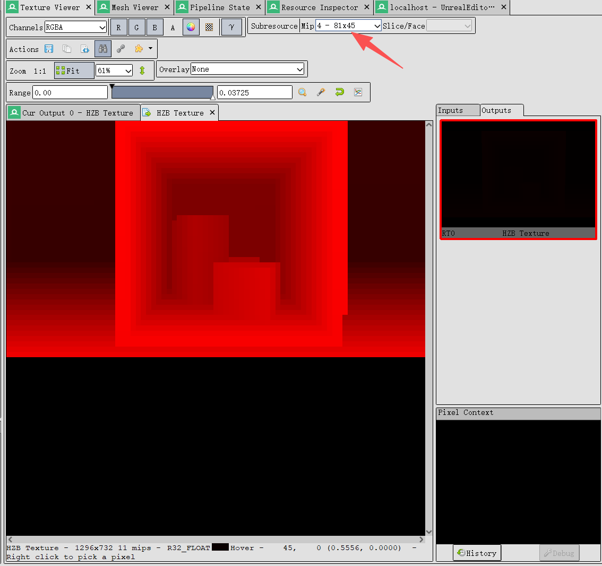
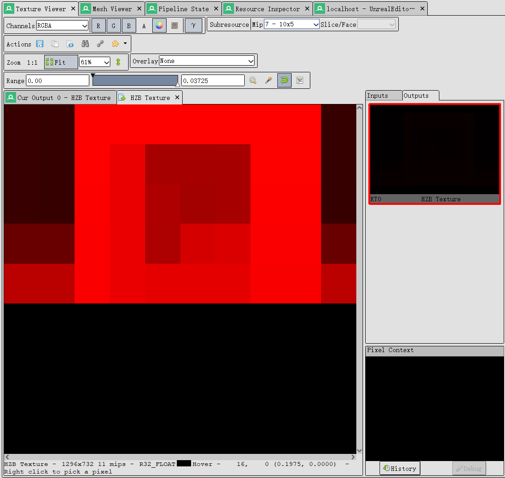
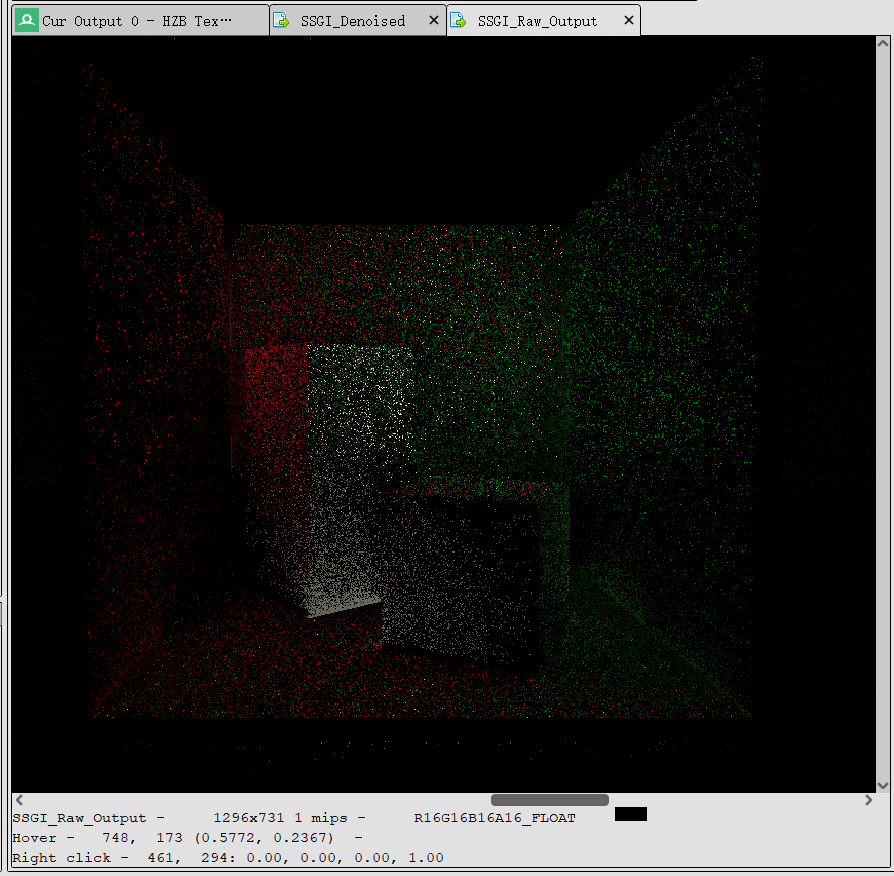
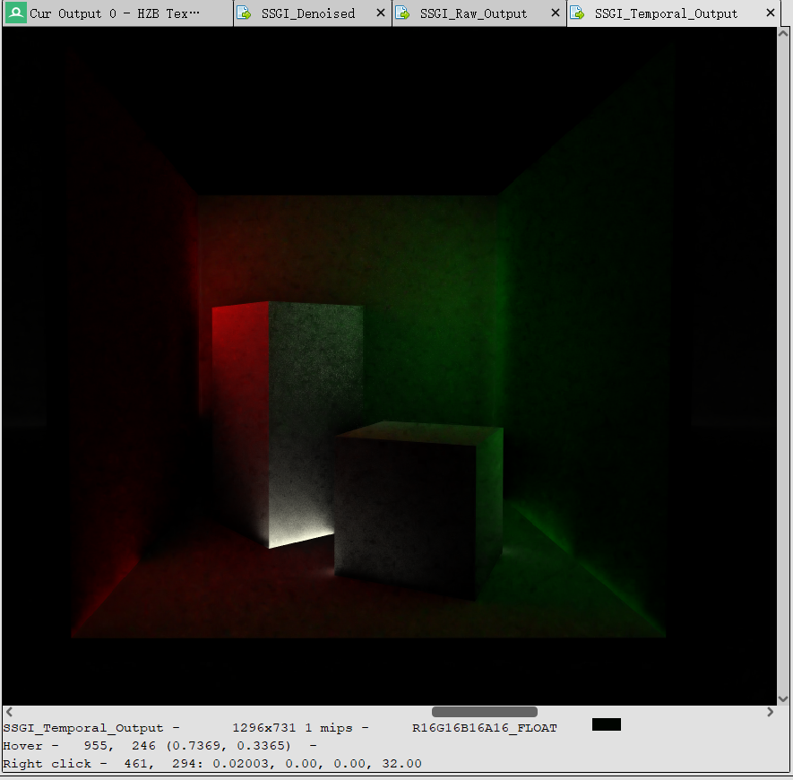

# HZB_SSGI

基于 **HZB** 的屏幕空间全局光照 **(SSGI)** 渲染

## 实现清单：

- [x] HZB生成
- [x] RayTracing函数，SSGI
- [x] 联合双边滤波单帧降噪
- [x] Temporal累积
- [ ] A-Trous Wavelet 加速单帧降噪
- [ ] DLC：实现HZB_SSR

## 效果展示

> 1SPP, 已经关闭场景里面的Luman GI和Luman Reflection

**效果对比GIF**

**未开启SSGI**

**SSGI Pass**

**SSGI Pass + Denoise Pass**

## RenderDoc抓帧分析

先看看UE的GPU Visualizer的Pass截图

<b>UE的GPU Visualizer的抓帧</b>

可以看到，HZB_SSGI插入到PostProcessing中，然后先生成了HZB，然后进行了SSGI Trace Pass生成带有噪声的SSGI效果，然后进行了Spatial Denosie对图片进行降噪，然后进行了Temporal通过多帧插值进行平滑噪点，最后进行Composite，颜色混合输出。

### HZB Texture

进行抓帧查看中间结果的图片，先看看HZB Texture Mip0的时候的图片。

<b>HZB-Mip 0</b>

<b>HZB-Mip 4</b>

<b>HZB-Mip 7</b>

### SSGI Pass

<b>SSGI Raw Ouput</b>

可以看到噪点非常严重。

### Denoise Pass

<b>SSGI Denoise Ouput</b>

### Temporal Pass

<b>SSGI Temporal Ouput</b>

